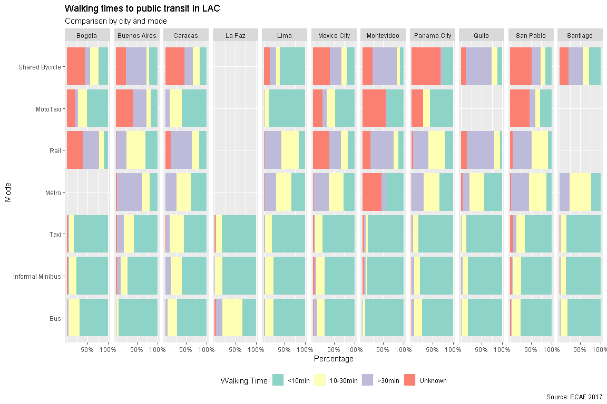

<!-- # html_notebook: default --> <!-- # word_document: default -->
<!-- # html_document: --> <!-- #   df_print: paged --> Load

    

# Income ranges from original file

# Approach to generating income groups

Compare the Quintile distribution to income distribution

## Razones para elegir vivienda // Por que no se muda

## Coverage

### Tiempo caminando a sistemas

    ## `summarise()` has grouped output by 'ciudad_0', 'Walking Time'. You can override using the `.groups` argument.

    ## List of 1
    ##  $ text:List of 11
    ##   ..$ family       : NULL
    ##   ..$ face         : NULL
    ##   ..$ colour       : NULL
    ##   ..$ size         : num 14
    ##   ..$ hjust        : NULL
    ##   ..$ vjust        : NULL
    ##   ..$ angle        : NULL
    ##   ..$ lineheight   : NULL
    ##   ..$ margin       : NULL
    ##   ..$ debug        : NULL
    ##   ..$ inherit.blank: logi FALSE
    ##   ..- attr(*, "class")= chr [1:2] "element_text" "element"
    ##  - attr(*, "class")= chr [1:2] "theme" "gg"
    ##  - attr(*, "complete")= logi FALSE
    ##  - attr(*, "validate")= logi TRUE

    ## `summarise()` has grouped output by 'ciudad_0', 'Walking Time', 'Mode2'. You can override using the `.groups` argument.

### Number of Vehicles

    ## `summarise()` has grouped output by 'ciudad_0', 'Number', 'Vehicle Type'. You can override using the `.groups` argument.

### Modal Share

    ## `summarise()` has grouped output by 'ciudad_0', 'Mode'. You can override using the `.groups` argument.

### Modal Share by Income

    ## `summarise()` has grouped output by 'ciudad_0', 'Mode', 'Indicator'. You can override using the `.groups` argument.

## Quality

“Si tu modo principal no estuviese disponible, que modo de transporte
publico utilizarias?”

    ## `summarise()` has grouped output by 'ciudad_0', 'Modo_Alternativo'. You can override using the `.groups` argument.

## Motivo por el cual no usa la alternativa

    ## `summarise()` has grouped output by 'ciudad_0', 'Motive', 'Modo_Alternativo'. You can override using the `.groups` argument.

    ## # A tibble: 238 x 6
    ##    ciudad_0 Modo_Alternativo Motive      Low    Medium High  
    ##    <fct>    <fct>            <fct>       <chr>  <chr>  <chr> 
    ##  1 Bogota   Bus/BRT          Costo       19.28% 17.56% 15.78%
    ##  2 Bogota   Metro            Costo       21.07% 18.79% 15.96%
    ##  3 Bogota   Other PT option  Costo       31.32% 28.29% 22.2% 
    ##  4 Bogota   Shared Bikes     Costo       21.02% 14.49% 9.14% 
    ##  5 Bogota   Bus/BRT          Tiempo      21.07% 26.73% 25%   
    ##  6 Bogota   Metro            Tiempo      21.38% 19.82% 20.46%
    ##  7 Bogota   Other PT option  Tiempo      14.96% 17.3%  21.81%
    ##  8 Bogota   Shared Bikes     Tiempo      19.58% 22.14% 17.29%
    ##  9 Bogota   Bus/BRT          Incomodidad 18.15% 22.87% 22.19%
    ## 10 Bogota   Metro            Incomodidad 23.88% 23.64% 26.31%
    ## # ... with 228 more rows

#### Combinaciones

    ## `summarise()` has grouped output by 'ciudad_0', 'Combination'. You can override using the `.groups` argument.

#### Accident rates

    ## `summarise()` has grouped output by 'ciudad_0', 'Value'. You can override using the `.groups` argument.

#### Aggregated

    ## `summarise()` has grouped output by 'Value'. You can override using the `.groups` argument.

    ## Warning: Removed 9 rows containing missing values (geom_text).

#### Abuse in PT

    ## `summarise()` has grouped output by 'ciudad_0', 'genero_1', 'Indicator'. You can override using the `.groups` argument.

#### By income quintile

    # Choose first, second or third
    var_1 = c("Indicator")

    var_2 = c("Value")

     var_3 = c("IG") #genero_1

    dt_plot = dt %>% 
      # filter(!!as.name(var_1) != "") %>% 
    group_by(ciudad_0,  !!as.name(var_3),!!as.name(var_1),!!as.name(var_2)) %>% summarise(tot = sum(peso.per)) %>% group_by(ciudad_0, !!as.name(var_3), !!as.name(var_1)) %>% mutate(per = tot / sum(tot)) %>% ungroup() %>% drop_na() 

    ## `summarise()` has grouped output by 'ciudad_0', 'IG', 'Indicator'. You can override using the `.groups` argument.

    # 
    # dt_plot = dt %>% filter(!!as.name(var_2) != "" & !!as.name(var_2) != "No" ) %>%  group_by(ciudad_0, !!as.name(var_1), !!as.name(var_2), !!as.name(var_3)) %>% summarise(tot = sum(peso.per)) %>% group_by(ciudad_0,!!as.name(var_3)) %>% mutate(per = tot / sum(tot)) %>% ungroup()

    dt_plot %>% filter(Value != 0) %>% 
      ggplot(aes(
      x = !!as.name(var_3) ,
      fill = !!as.name(var_2),
      y = per
    )) +
      geom_bar(stat = "identity", position = "dodge") + facet_grid(ciudad_0 ~ Indicator) +
      geom_text(mapping = aes(x = !!as.name(var_3), y = per, 
                              label = ifelse(per > 0.05,
                                             paste0(round(per*100,2),"%"),"")),
                position = position_fill(vjust = 0.5),
                size = 3)+
      scale_y_continuous(breaks = c(0.25, 0.5) , labels = scales::percent) +
      labs(y = "Percentage",
           title = "Have you suffered any of the following harrasments in public transit?",
           subtitle = "An investigation using survey data") + coord_flip()

