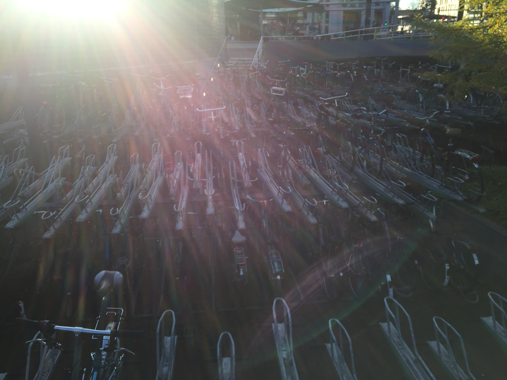
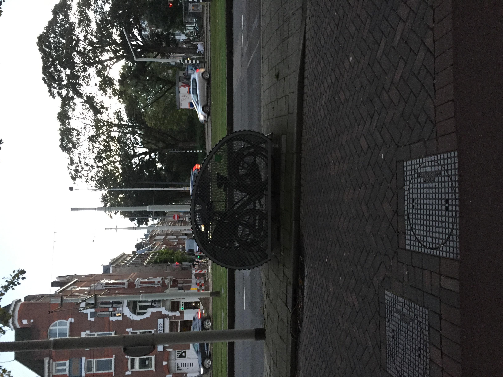
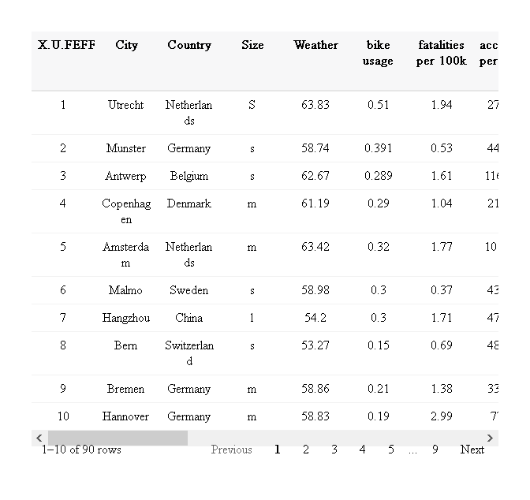
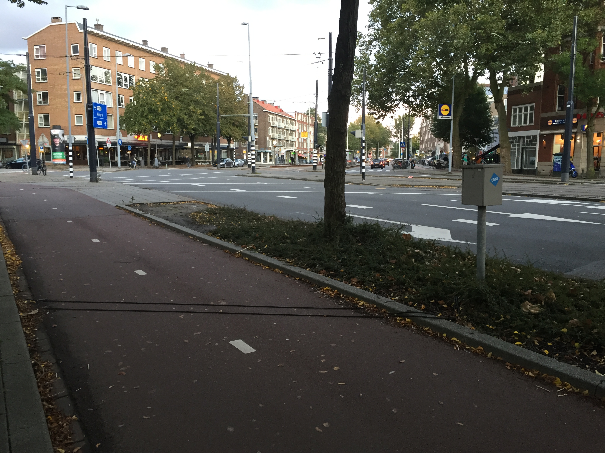
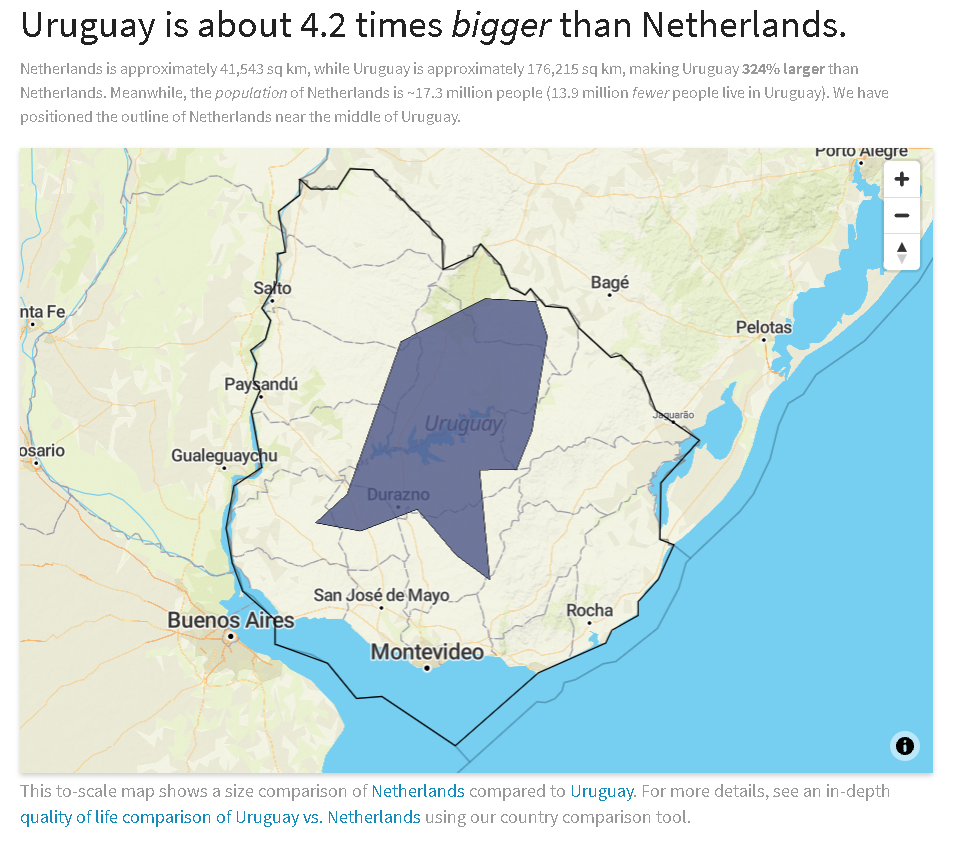

I have a girlfriend who has rode a bycicle 9 times in her lifetime.
However, at the second day we arrive to the Netherlands, she suggests
she should get a scooter to perform a 2-hour commute.

The Netherlands is one of the safest countries in the world for riding a
bike, with only 3.8 road deaths per 100.000 inhabitants.

## Dedicated infrastructure

### Parking

Bicycle facilities that accomodate everyone.

The bike lane availability is incredible.

## Intermodal

You can take the bicycle anywhere. Hop on the metro. Hop on the train.
Especially around hubs, there is a safe place to leave your bicycle.
This leads to the next topic

## Culture

Bike goes Before pedestrians even!

## Safety

    ## Warning: package 'magrittr' was built under R version 4.0.3

    ## 
    ## Attaching package: 'magrittr'

    ## The following object is masked from 'package:purrr':
    ## 
    ##     set_names

    ## The following object is masked from 'package:tidyr':
    ## 
    ##     extract

    ## Warning: package 'reactable' was built under R version 4.0.5

## Measure

 

## Geography

Everything is close and flat, as made clear by this picture

131 out of 195 not THAT bad.

<https://en.wikipedia.org/wiki/List_of_countries_and_dependencies_by_area>
